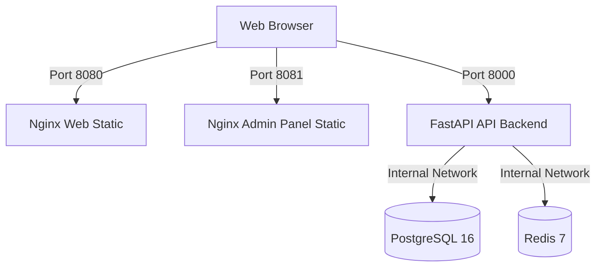

# Santis OS — Docker Runtime Seal (TD-007)

This document formalizes the deployment and containerization of the Santis OS ecosystem under strict **Sovereign Quiet Luxury** engineering and local DevOps architecture standards. 

---

## 🛡️ 1. Architectural Overview

The local Docker execution runtime containerizes the clean workspace state without altering the production cloud deployment paths (Vercel/Cloudflare).
 

The environment orchestrates five services over a isolated network boundary:



---

## 📁 2. Deliverables and Configurations

### 1. `.dockerignore`
Isolates build contexts recursively using wildcard expressions (`**/node_modules`) to prevent local host-compiled dependency leakage and broken symlinks inside container boundaries.

### 2. `compose.yml`
Defines orchestration for all 5 services with internal service linking, environment injection, port maps, and health checks:
- **`api`**: Custom FastAPI container exposed on port `8000`.
- **`web`**: Static Nginx container exposed on port `8080`.
- **`admin-panel`**: Static Nginx container exposed on port `8081`.
- **`postgres`**: PostgreSQL 16 exposed on `5432`.
- **`redis`**: Redis 7 mapped to host port `16379` to prevent conflicts.

### 3. `docker/api/Dockerfile`
- Base: `python:3.12-slim`
- Fully compatible with dynamic launcher entrypoints (`uvicorn ${SANTIS_API_APP:-server:app}`).
- Healthcheck endpoint: `/health`.

### 4. `docker/web/Dockerfile` & `nginx.conf`
- Base: `nginx:1.27-alpine`
- Serves the static site directly from the source directory, bypassing heavy build dependencies.

### 5. `docker/admin-panel/Dockerfile` & `nginx.conf`
- Base: `node:20-alpine` (Stage 1) -> `nginx:1.27-alpine` (Stage 2)
- Multi-stage build leveraging Corepack for PNPM 10 workspace resolution and production minification.

---

## 🔑 3. Port Mapping and Hardening (WSL2 / Hyper-V Mitigation)

To prevent port allocation conflicts on Windows dev machines:
- **Redis Exclusion Bypass**: The host port is mapped to `16379:6379`. This avoids Hyper-V / WSL2 administered port exclusion ranges (e.g. `6354-6453`) that block host binding.
- **Internal Service Communication**: The API backend continues to reference `redis:6379` within the container network mesh (`santis_network`), keeping data paths completely isolated.

---

## 🟢 4. Verification and Validation Procedures

### Repository Lint / Compile Verification
Before building, run the standard workspace verification suite:
```bash
pnpm run tokens:css:check
pnpm run lint
pnpm run build
pnpm run audit:all
```

### Container Spin-Up & Inspection
```bash
# Build the images
docker compose build

# Launch the orchestrator in the background
docker compose up -d

# Inspect active services
docker compose ps
```

### Healthy Endpoint Handshakes
```bash
# Verify API Healthcheck (returns HTTP 200 OK)
curl.exe -s http://localhost:8000/health

# Verify Public Web Static Page
curl.exe -I http://localhost:8080

# Verify Admin Panel Static Page
curl.exe -I http://localhost:8081
```

---

## 🔒 5. Production Hardening: Non-Root Execution (TD-008.1)

To protect the container environment from privilege escalation and runtime compromise, all application containers run completely as secure, unprivileged non-root users:

### 1. API Container (`docker/api/Dockerfile`)
- An unprivileged system user/group `santis:santis` (UID/GID `10001`) is created during the build.
- The `WORKDIR /app` and all application source files are owned by the `santis` user using `COPY --chown=santis:santis`.
- The container runtime strictly enforces `USER santis` before launching Uvicorn on unprivileged port `8000`.

### 2. Static Web & Admin-Panel Containers (`docker/web/` & `docker/admin-panel/`)
- By default, standard Nginx binds to privileged port `80` and requires root privileges.
- Both web server configurations are modified to listen on unprivileged port `8080` internally (`listen 8080;` in `nginx.conf`).
- During build, permissions for Nginx run-time paths (`/var/run/nginx.pid`, `/var/cache/nginx`, `/var/log/nginx`, `/usr/share/nginx/html`, `/etc/nginx/conf.d`) are recursively changed to unprivileged user `nginx`.
- The container runtime strictly enforces `USER nginx` and executes with zero root privileges on exposed host ports (`8080:8080` for public web, `8081:8080` for admin panel).

