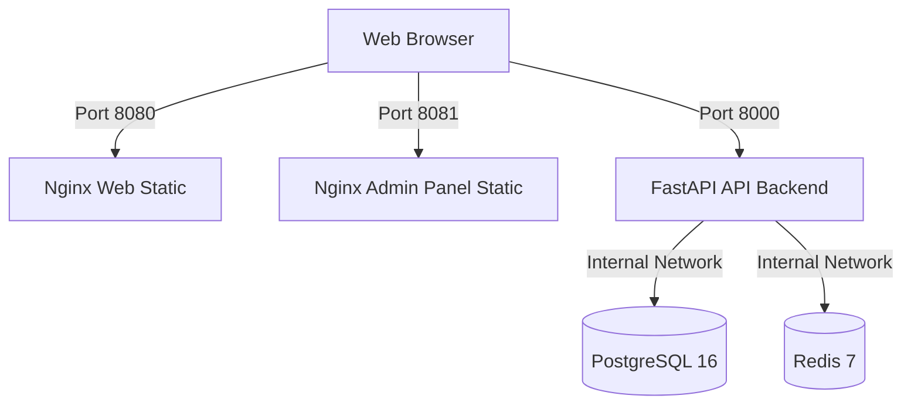

# Santis OS — Docker Runtime Seal (TD-007)

This document formalizes the deployment and containerization of the Santis OS ecosystem under strict **Sovereign Quiet Luxury** engineering and local DevOps architecture standards. 

---

## 🛡️ 1. Architectural Overview

The local Docker execution runtime containerizes the clean workspace state without altering the production cloud deployment paths (Vercel/Cloudflare).
 

The environment orchestrates five services over a isolated network boundary:



---

## 📁 2. Deliverables and Configurations

### 1. `.dockerignore`
Isolates build contexts recursively using wildcard expressions (`**/node_modules`) to prevent local host-compiled dependency leakage and broken symlinks inside container boundaries.

### 2. `compose.yml`
Defines local/dev orchestration for all 5 services with internal service linking, environment injection, port maps, and health checks:
- **`api`**: Custom FastAPI container exposed on host port `8000`.
- **`web`**: Static Nginx container exposed on host port `8080`.
- **`admin-panel`**: Static Nginx container exposed on host port `8081`.
- **`postgres`**: PostgreSQL 16 exposed on host port `5432` for local tooling.
- **`redis`**: Redis 7 mapped to host port `16379` to prevent local conflicts.

### 3. `docker/api/Dockerfile`
- Base: `python:3.12-slim`
- Fully compatible with dynamic launcher entrypoints (`uvicorn ${SANTIS_API_APP:-server:app}`).
- Healthcheck endpoint: `/health`.

### 4. `docker/web/Dockerfile` & `nginx.conf`
- Base: `nginx:1.27-alpine`
- Serves the static site directly from the source directory, bypassing heavy build dependencies.

### 5. `docker/admin-panel/Dockerfile` & `nginx.conf`
- Base: `node:20-alpine` (Stage 1) -> `nginx:1.27-alpine` (Stage 2)
- Multi-stage build leveraging Corepack for PNPM 10 workspace resolution and production minification.

---

## 🔑 3. Port Mapping and Hardening (WSL2 / Hyper-V Mitigation)

To prevent port allocation conflicts on Windows dev machines:
- **Redis Exclusion Bypass**: The local host port is mapped to `16379:6379`. This avoids Hyper-V / WSL2 administered port exclusion ranges (e.g. `6354-6453`) that block host binding.
- **Internal Service Communication**: The API backend continues to reference `redis:6379` within the container network mesh, keeping data paths isolated.

---

## 🟢 4. Verification and Validation Procedures

### Repository Lint / Compile Verification
Before building, run the standard workspace verification suite:
```bash
pnpm run tokens:css:check
pnpm run lint
pnpm run build
pnpm run audit:all
```

### Container Spin-Up & Inspection
```bash
# Build the images
docker compose build

# Launch the local orchestrator in the background
docker compose up -d

# Inspect active services
docker compose ps
```

### Healthy Endpoint Handshakes
```bash
# Verify API Healthcheck (returns HTTP 200 OK)
curl.exe -s http://localhost:8000/health

# Verify Public Web Static Page
curl.exe -I http://localhost:8080

# Verify Admin Panel Static Page
curl.exe -I http://localhost:8081
```

---

## 🔒 5. Production Hardening: Non-Root Execution (TD-008.1)

To protect the container environment from privilege escalation and runtime compromise, all application containers run as secure, unprivileged non-root users, ensuring that privilege escalation and host exposure risks are significantly reduced.

### 1. API Container (`docker/api/Dockerfile`)
- An unprivileged system user/group `santis:santis` (UID/GID `10001`) is created during the build.
- The `WORKDIR /app` and all application source files are owned by the `santis` user using `COPY --chown=santis:santis`.
- The container runtime strictly enforces `USER santis` before launching Uvicorn on unprivileged port `8000`.

### 2. Static Web & Admin-Panel Containers (`docker/web/` & `docker/admin-panel/`)
- By default, standard Nginx binds to privileged port `80` and requires root privileges.
- Both web server configurations are modified to listen on unprivileged port `8080` internally (`listen 8080;` in `nginx.conf`).
- During build, permissions for Nginx run-time paths (`/var/run/nginx.pid`, `/var/cache/nginx`, `/var/log/nginx`, `/usr/share/nginx/html`, `/etc/nginx/conf.d`) are recursively changed to unprivileged user `nginx`.
- The container runtime strictly enforces `USER nginx` and executes with zero root privileges on exposed host ports (`8080:8080` for public web, `8081:8080` for admin panel).

---

## 🛡️ 6. Production Orchestration: `compose.prod.yml` (TD-008.2)

`compose.prod.yml` is a production-oriented overlay for Docker Compose. It keeps `compose.yml` as the local/dev runtime and applies stricter production boundaries only when explicitly included:

```bash
DATABASE_URL=postgresql://santis:<secret>@postgres:5432/santis \
POSTGRES_PASSWORD=<secret> \
docker compose -f compose.yml -f compose.prod.yml up -d --build
```

### 1. Production Port Isolation
- Public web, admin panel, and API host exposure remain explicit and documented.
- PostgreSQL and Redis host port mappings from the local compose file are reset in the production overlay.
- Data services remain reachable only through the internal Docker network.

### 2. Read-Only Container Filesystems (`read_only: true`)
Application containers run with read-only root filesystems to reduce arbitrary runtime mutation risk:
- `api`
- `web`
- `admin-panel`

### 3. Ephemeral In-Memory Storage (`tmpfs`)
Constrained `tmpfs` mounts are defined only where the runtime needs writable paths:
- **API Backend**: `/tmp:size=64m,mode=1777`
- **Nginx Web & Admin**: `/tmp:size=64m,mode=1777`, `/var/cache/nginx:size=64m,mode=1777`, `/var/run:size=16m,mode=1777`

### 4. Production Service Recovery
All runtime services use automatic recovery semantics:

```yaml
restart: unless-stopped
```

### 5. Secrets Strategy
`compose.prod.yml` does not commit real production secrets. High-entropy values must be injected by the runtime/orchestrator:
- `DATABASE_URL`
- `POSTGRES_PASSWORD`
- optional `POSTGRES_DB`, `POSTGRES_USER`, `REDIS_URL`, and `SANTIS_API_APP` overrides

### 6. Production Overlay Validation
Use the Compose config renderer to verify the merged production graph before launch:

```bash
docker compose -f compose.yml -f compose.prod.yml config
```

Expected production result:
- `postgres` has no host `ports` mapping.
- `redis` has no host `ports` mapping.
- `api`, `web`, and `admin-panel` retain explicit external exposure.
- application containers retain non-root runtime users from their Dockerfiles.

---

## 🩺 7. Healthcheck Standardization (TD-008.3)

To ensure high availability, fast failover, and strict startup ordering, lightweight healthchecks are standardized across all services:

### 1. Light Nginx Health Endpoint (`/healthz`)
Both `web` and `admin-panel` Nginx configurations contain a custom, ultra-lightweight `/healthz` block:
```nginx
location = /healthz {
    access_log off;
    add_header Content-Type text/plain;
    return 200 'OK';
}
```
This serves a plain `200 OK` response directly in-memory, completely bypassing local disk lookup and avoiding access log pollution.

### 2. Standarized Healthcheck Commands
All service health checks utilize lightweight tools native to each container, avoiding external loopback resolution gotchas (standardized to IPv4 loopback `127.0.0.1` to prevent IPv6 resolution traps on BusyBox shells):
- **API backend**: `curl -f http://127.0.0.1:8000/health` (Debian-based curl)
- **Static Nginx Web**: `wget --no-verbose --tries=1 --spider http://127.0.0.1:8080/healthz || exit 1` (Alpine-based BusyBox wget)
- **Admin Panel SPA**: `wget --no-verbose --tries=1 --spider http://127.0.0.1:8080/healthz || exit 1` (Alpine-based BusyBox wget)
- **PostgreSQL**: `pg_isready -U santis -d santis` (Built-in Postgres health utility)
- **Redis**: `redis-cli ping` (Built-in Redis client ping)

### 3. Startup Dependency Order (`condition: service_healthy`)
To guarantee that consumer services only launch when their dependencies are fully initialized and ready to receive traffic:
- **API** only starts after both **postgres** and **redis** report `healthy`.
- **web** and **admin-panel** only start after the **api** backend reports `healthy`.

This eliminates container startup race conditions and socket connection failures during deployments.

---

## 🔒 8. Read-Only Runtime Mutability Proof (TD-008.4)

The production overlay strictly validates that application containers cannot mutate their runtime source or static asset directories. Only explicitly declared `tmpfs` paths remain writable, preventing local code tampering and guaranteeing container immutability.

### 1. Automated Mutability Proof Script
A dedicated automated audit script is registered under `scripts/active/audit-docker-readonly-runtime.mjs`. This script performs automated live-write attempts inside active production containers to verify isolation constraints:

```bash
node scripts/active/audit-docker-readonly-runtime.mjs
```

### 2. Mutability Testing Matrix
The actual validation tests yield the following exact PASS/FAIL matrix across all services:

| Service | Target Directory | Path Type | Expected Writability | Live Status |
| :--- | :--- | :--- | :--- | :--- |
| **api** | `/tmp` | Ephemeral `tmpfs` | **PASS** (Writable) | ✅ MATCHED |
| **api** | `/app` | Source Code Root | **FAIL** (Read-Only) | ✅ MATCHED |
| **web** | `/tmp` | Ephemeral `tmpfs` | **PASS** (Writable) | ✅ MATCHED |
| **web** | `/usr/share/nginx/html` | Static Assets Root | **FAIL** (Read-Only) | ✅ MATCHED |
| **admin-panel** | `/tmp` | Ephemeral `tmpfs` | **PASS** (Writable) | ✅ MATCHED |
| **admin-panel** | `/usr/share/nginx/html` | SPA Static Assets Root | **FAIL** (Read-Only) | ✅ MATCHED |

### 3. HTTP Endpoint Integrity
Even under maximum root read-only constraint enforcement, all service endpoints remain completely functional and resolve with `200 OK`:
- API Backend: `http://localhost:8000/health` -> `200 OK`
- Public Web Server: `http://localhost:8080/healthz` -> `200 OK`
- Admin Panel Server: `http://localhost:8081/healthz` -> `200 OK`

---

## 🚀 9. Automated CI/CD Validation (TD-008.5)

To guarantee that no security regressions or build failures bypass the gateway, a dedicated GitHub Actions workflow is integrated at `.github/workflows/docker-build-validation.yml`.

### 1. Verification Sequence
Every push or pull request targeting the `develop` or `main` branches triggers the automated hardening pipeline:
1. **Syntax Integrity**: Merges the compose definitions and validates syntax with `docker compose config`.
2. **Parallel Compilation**: Compiles the entire monorepo Docker image stack in parallel with cached layers.
3. **Boot & Health Check**: Boots up the Postgres, Redis, API, Web, and Admin-Panel stack, waiting for all 5 containers to report `healthy`.
4. **Mutability Audit**: Executes the zero-dependency `/tmp` vs source directory mutability proof check via `node scripts/active/audit-docker-readonly-runtime.mjs`.
5. **Teardown**: Gracefully tears down the network and database volumes after execution.

This CI gate ensures that all container constraints remain permanently locked, secure, and regression-free.


