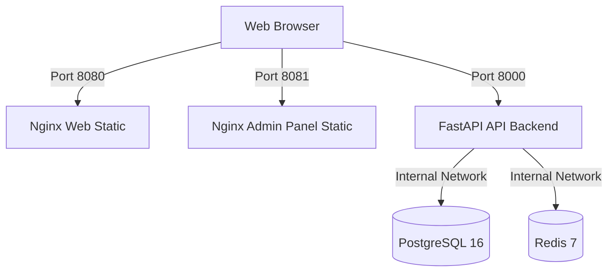

# Santis OS — Docker Runtime Seal (TD-007)

This document formalizes the deployment and containerization of the Santis OS ecosystem under strict **Sovereign Quiet Luxury** engineering and local DevOps architecture standards. 

---

## 🛡️ 1. Architectural Overview

The local Docker execution runtime containerizes the clean workspace state without altering the production cloud deployment paths (Vercel/Cloudflare).
 

The environment orchestrates five services over a isolated network boundary:



---

## 📁 2. Deliverables and Configurations

### 1. `.dockerignore`
Isolates build contexts recursively using wildcard expressions (`**/node_modules`) to prevent local host-compiled dependency leakage and broken symlinks inside container boundaries.

### 2. `compose.yml`
Defines local/dev orchestration for all 5 services with internal service linking, environment injection, port maps, and health checks:
- **`api`**: Custom FastAPI container exposed on host port `8000`.
- **`web`**: Static Nginx container exposed on host port `8080`.
- **`admin-panel`**: Static Nginx container exposed on host port `8081`.
- **`postgres`**: PostgreSQL 16 exposed on host port `5432` for local tooling.
- **`redis`**: Redis 7 mapped to host port `16379` to prevent local conflicts.

### 3. `docker/api/Dockerfile`
- Base: `python:3.12-slim`
- Fully compatible with dynamic launcher entrypoints (`uvicorn ${SANTIS_API_APP:-server:app}`).
- Healthcheck endpoint: `/health`.

### 4. `docker/web/Dockerfile` & `nginx.conf`
- Base: `nginx:1.27-alpine`
- Serves the static site directly from the source directory, bypassing heavy build dependencies.

### 5. `docker/admin-panel/Dockerfile` & `nginx.conf`
- Base: `node:20-alpine` (Stage 1) -> `nginx:1.27-alpine` (Stage 2)
- Multi-stage build leveraging Corepack for PNPM 10 workspace resolution and production minification.

---

## 🔑 3. Port Mapping and Hardening (WSL2 / Hyper-V Mitigation)

To prevent port allocation conflicts on Windows dev machines:
- **Redis Exclusion Bypass**: The local host port is mapped to `16379:6379`. This avoids Hyper-V / WSL2 administered port exclusion ranges (e.g. `6354-6453`) that block host binding.
- **Internal Service Communication**: The API backend continues to reference `redis:6379` within the container network mesh, keeping data paths isolated.

---

## 🟢 4. Verification and Validation Procedures

### Repository Lint / Compile Verification
Before building, run the standard workspace verification suite:
```bash
pnpm run tokens:css:check
pnpm run lint
pnpm run build
pnpm run audit:all
```

### Container Spin-Up & Inspection
```bash
# Build the images
docker compose build

# Launch the local orchestrator in the background
docker compose up -d

# Inspect active services
docker compose ps
```

### Healthy Endpoint Handshakes
```bash
# Verify API Healthcheck (returns HTTP 200 OK)
curl.exe -s http://localhost:8000/health

# Verify Public Web Static Page
curl.exe -I http://localhost:8080

# Verify Admin Panel Static Page
curl.exe -I http://localhost:8081
```

---

## 🔒 5. Production Hardening: Non-Root Execution (TD-008.1)

To protect the container environment from privilege escalation and runtime compromise, all application containers run as secure, unprivileged non-root users, ensuring that privilege escalation and host exposure risks are significantly reduced.

### 1. API Container (`docker/api/Dockerfile`)
- An unprivileged system user/group `santis:santis` (UID/GID `10001`) is created during the build.
- The `WORKDIR /app` and all application source files are owned by the `santis` user using `COPY --chown=santis:santis`.
- The container runtime strictly enforces `USER santis` before launching Uvicorn on unprivileged port `8000`.

### 2. Static Web & Admin-Panel Containers (`docker/web/` & `docker/admin-panel/`)
- By default, standard Nginx binds to privileged port `80` and requires root privileges.
- Both web server configurations are modified to listen on unprivileged port `8080` internally (`listen 8080;` in `nginx.conf`).
- During build, permissions for Nginx run-time paths (`/var/run/nginx.pid`, `/var/cache/nginx`, `/var/log/nginx`, `/usr/share/nginx/html`, `/etc/nginx/conf.d`) are recursively changed to unprivileged user `nginx`.
- The container runtime strictly enforces `USER nginx` and executes with zero root privileges on exposed host ports (`8080:8080` for public web, `8081:8080` for admin panel).

---

## 🛡️ 6. Production Orchestration: `compose.prod.yml` (TD-008.2)

`compose.prod.yml` is a production-oriented overlay for Docker Compose. It keeps `compose.yml` as the local/dev runtime and applies stricter production boundaries only when explicitly included:

```bash
DATABASE_URL=postgresql://santis:<secret>@postgres:5432/santis \
POSTGRES_PASSWORD=<secret> \
docker compose -f compose.yml -f compose.prod.yml up -d --build
```

### 1. Production Port Isolation
- Public web, admin panel, and API host exposure remain explicit and documented.
- PostgreSQL and Redis host port mappings from the local compose file are reset in the production overlay.
- Data services remain reachable only through the internal Docker network.

### 2. Read-Only Container Filesystems (`read_only: true`)
Application containers run with read-only root filesystems to reduce arbitrary runtime mutation risk:
- `api`
- `web`
- `admin-panel`

### 3. Ephemeral In-Memory Storage (`tmpfs`)
Constrained `tmpfs` mounts are defined only where the runtime needs writable paths:
- **API Backend**: `/tmp:size=64m,mode=1777`
- **Nginx Web & Admin**: `/tmp:size=64m,mode=1777`, `/var/cache/nginx:size=64m,mode=1777`, `/var/run:size=16m,mode=1777`

### 4. Production Service Recovery
All runtime services use automatic recovery semantics:

```yaml
restart: unless-stopped
```

### 5. Secrets Strategy
`compose.prod.yml` does not commit real production secrets. High-entropy values must be injected by the runtime/orchestrator:
- `DATABASE_URL`
- `POSTGRES_PASSWORD`
- optional `POSTGRES_DB`, `POSTGRES_USER`, `REDIS_URL`, and `SANTIS_API_APP` overrides

### 6. Production Overlay Validation
Use the Compose config renderer to verify the merged production graph before launch:

```bash
docker compose -f compose.yml -f compose.prod.yml config
```

Expected production result:
- `postgres` has no host `ports` mapping.
- `redis` has no host `ports` mapping.
- `api`, `web`, and `admin-panel` retain explicit external exposure.
- application containers retain non-root runtime users from their Dockerfiles.

---

## 🩺 7. Healthcheck Standardization (TD-008.3)

To ensure high availability, fast failover, and strict startup ordering, lightweight healthchecks are standardized across all services:

### 1. Light Nginx Health Endpoint (`/healthz`)
Both `web` and `admin-panel` Nginx configurations contain a custom, ultra-lightweight `/healthz` block:
```nginx
location = /healthz {
    access_log off;
    add_header Content-Type text/plain;
    return 200 'OK';
}
```
This serves a plain `200 OK` response directly in-memory, completely bypassing local disk lookup and avoiding access log pollution.

### 2. Standarized Healthcheck Commands
All service health checks utilize lightweight tools native to each container, avoiding external loopback resolution gotchas (standardized to IPv4 loopback `127.0.0.1` to prevent IPv6 resolution traps on BusyBox shells):
- **API backend**: `curl -f http://127.0.0.1:8000/health` (Debian-based curl)
- **Static Nginx Web**: `wget --no-verbose --tries=1 --spider http://127.0.0.1:8080/healthz || exit 1` (Alpine-based BusyBox wget)
- **Admin Panel SPA**: `wget --no-verbose --tries=1 --spider http://127.0.0.1:8080/healthz || exit 1` (Alpine-based BusyBox wget)
- **PostgreSQL**: `pg_isready -U santis -d santis` (Built-in Postgres health utility)
- **Redis**: `redis-cli ping` (Built-in Redis client ping)

### 3. Startup Dependency Order (`condition: service_healthy`)
To guarantee that consumer services only launch when their dependencies are fully initialized and ready to receive traffic:
- **API** only starts after both **postgres** and **redis** report `healthy`.
- **web** and **admin-panel** only start after the **api** backend reports `healthy`.

This eliminates container startup race conditions and socket connection failures during deployments.

---

## 🔒 8. Read-Only Runtime Mutability Proof (TD-008.4)

The production overlay strictly validates that application containers cannot mutate their runtime source or static asset directories. Only explicitly declared `tmpfs` paths remain writable, preventing local code tampering and guaranteeing container immutability.

### 1. Automated Mutability Proof Script
A dedicated automated audit script is registered under `scripts/active/audit-docker-readonly-runtime.mjs`. This script performs automated live-write attempts inside active production containers to verify isolation constraints:

```bash
node scripts/active/audit-docker-readonly-runtime.mjs
```

### 2. Mutability Testing Matrix
The actual validation tests yield the following exact PASS/FAIL matrix across all services:

| Service | Target Directory | Path Type | Expected Writability | Live Status |
| :--- | :--- | :--- | :--- | :--- |
| **api** | `/tmp` | Ephemeral `tmpfs` | **PASS** (Writable) | ✅ MATCHED |
| **api** | `/app` | Source Code Root | **FAIL** (Read-Only) | ✅ MATCHED |
| **web** | `/tmp` | Ephemeral `tmpfs` | **PASS** (Writable) | ✅ MATCHED |
| **web** | `/usr/share/nginx/html` | Static Assets Root | **FAIL** (Read-Only) | ✅ MATCHED |
| **admin-panel** | `/tmp` | Ephemeral `tmpfs` | **PASS** (Writable) | ✅ MATCHED |
| **admin-panel** | `/usr/share/nginx/html` | SPA Static Assets Root | **FAIL** (Read-Only) | ✅ MATCHED |

### 3. HTTP Endpoint Integrity
Even under maximum root read-only constraint enforcement, all service endpoints remain completely functional and resolve with `200 OK`:
- API Backend: `http://localhost:8000/health` -> `200 OK`
- Public Web Server: `http://localhost:8080/healthz` -> `200 OK`
- Admin Panel Server: `http://localhost:8081/healthz` -> `200 OK`

---

## 🚀 9. Automated CI/CD Validation (TD-008.5)

To guarantee that no security regressions or build failures bypass the gateway, a dedicated GitHub Actions workflow is integrated at `.github/workflows/docker-build-validation.yml`.

### 1. Verification Sequence
Every push or pull request targeting the `develop` or `main` branches triggers the automated hardening pipeline:
1. **Syntax Integrity**: Merges the compose definitions and validates syntax with `docker compose config`.
2. **Parallel Compilation**: Compiles the entire monorepo Docker image stack in parallel with cached layers.
3. **Boot & Health Check**: Boots up the Postgres, Redis, API, Web, and Admin-Panel stack, waiting for all 5 containers to report `healthy`.
4. **Mutability Audit**: Executes the zero-dependency `/tmp` vs source directory mutability proof check via `node scripts/active/audit-docker-readonly-runtime.mjs`.
5. **Teardown**: Gracefully tears down the network and database volumes after execution.

This CI gate ensures that all container constraints remain permanently locked, secure, and regression-free.

---

## 🔑 10. Centralized Secrets Injection Strategy (TD-008.6)

Production environment secrets are never committed to the repository. The boundary between local development variables and production-grade secrets is strictly enforced.

### 1. Dev vs. Prod Secret Boundaries
- **Local Development (`.env`)**: Uses insecure defaults defined in `.env.example`. Copied to a local `.env` file that is ignored by Git. Secure cookies are disabled locally (`SESSION_COOKIE_SECURE=false`).
- **Production Secrets**: Injected dynamically at runtime via Secret Manager (e.g., AWS/GCP) or CI/CD pipelines. Never persisted to disk. Enforces `SESSION_COOKIE_SECURE=true`.

### 2. GitHub Actions Production Secrets Map
To deploy or validate the stack in production environments, the following secrets must be registered under **GitHub Actions Secrets**:

| Secret Key | Description | Scope / Destination |
| :--- | :--- | :--- |
| `DATABASE_URL` | Production PostgreSQL connection URL (SSL/TLS enforced) | `api` container environment |
| `POSTGRES_PASSWORD` | Cryptographically random root password for production Postgres | `postgres` container environment |
| `SESSION_TOKEN_SECRET` | 32+ character high-entropy key for signing user sessions | `api` container environment |
| `STRIPE_API_KEY` | Private production authorization key for Stripe API | `api` container environment |
| `STRIPE_WEBHOOK_SECRET` | Signing secret used to authenticate incoming Stripe payment webhooks | `api` container environment |

### 3. Automated Secret Leakage Audit
Accidental commits of high-entropy keys are prevented by the expanded **Sovereign Environment & Secret Leakage Audit Script** at `scripts/active/audit-production-env.mjs`:

```bash
node scripts/active/audit-production-env.mjs
```

This script automatically scans all tracked files in the workspace against regex signatures for Stripe live secret keys (`sk_live_...`), webhook signing secrets (`whsec_live_...`), and generic hardcoded keys, failing the deployment pipeline if any leak is detected.

---

## 💾 11. PostgreSQL Backup & Restore Protocol (TD-008.7)

To prevent data loss and support disaster recovery, Santis OS utilizes a zero-dependency, automated protocol for **online backups** and **controlled maintenance restores** executing inside unprivileged container boundaries.

### ⚠️ Critical Security Policies
- **Backups are Never Committed to Git**: The `./backups/` directory is strictly ignored by Git and Docker context (`.gitignore` and `.dockerignore`) to prevent accidental exposure of raw data dumps.
- **Destructive Operation Guard**: To prevent accidental data loss, the restore protocol strictly blocks execution unless explicitly authorized by setting `SANTIS_RESTORE_CONFIRM=YES` in the process environment.

---

### 1. Online Backup (`backup-db.mjs`)
Database dumps are generated online without stopping active services, compressed via gzip on-the-fly, and saved locally with timestamped filenames:

```bash
pnpm run db:backup
# or: node scripts/active/backup-db.mjs
```

**Workflow Steps**:
1. **Dynamic Environment Extraction**: Node queries the container's environment dynamically via `docker compose exec` to resolve the current `POSTGRES_USER` and `POSTGRES_DB` values.
2. **Online pg_dump**: Spawns `pg_dump` with `--no-owner --no-privileges` to output clean, portable plain SQL.
3. **Piped Compression**: Streams raw SQL stdout natively into Node's `zlib.createGzip()`, saving it to `backups/santis_backup_YYYYMMDD_HHMMSS.sql.gz`.
4. **Integrity Verification**: Performs automatic file size check (> 0 bytes) and verifies archive integrity (`gzip -t` or native Node zlib decompress fallback).
5. **Retention Rotation Policy**: Retains only the last **7 daily backups** to prevent disk space exhaustion, rotating older copies automatically.

---

### 2. Controlled Maintenance Restore (`restore-db.mjs`)
Restoring persistent state is a **destructive maintenance operation** that requires planned downtime.

```bash
SANTIS_RESTORE_CONFIRM=YES pnpm run db:restore backups/santis_backup_YYYYMMDD_HHMMSS.sql.gz
# or: SANTIS_RESTORE_CONFIRM=YES node scripts/active/restore-db.mjs backups/santis_backup_YYYYMMDD_HHMMSS.sql.gz
```

**Disaster Recovery Execution Steps**:
1. **Destructive Guard Assert**: Blocks execution if `SANTIS_RESTORE_CONFIRM !== "YES"`.
2. **Safe Input Sanitization**: Rejects path traversal and verifies that the file exists and has the `.sql.gz` extension.
3. **Integrity Validation**: Runs a pre-restore `gzip -t` integrity validation check on the targeted archive file.
4. **Target DB Termination**: Connects to the `postgres` maintenance database (instead of the target DB) and terminates all active client connections to prevent DB-busy errors.
5. **Database Re-creation**: Drops the existing target database and recreates a clean database with the correct owner:
   ```sql
   DROP DATABASE IF EXISTS santis;
   CREATE DATABASE santis OWNER santis;
   ```
6. **Streaming Decompression Restore**: Decodes the `.sql.gz` archive on-the-fly and streams plain SQL directly into the container's `psql` instance.
7. **Post-Restore Integrity Check**: Runs a validation check (`SELECT 1;`) to confirm the recovered database is healthy and fully accessible.

---

### 3. Production Scheduler & Orchestrator Integration
For production clusters, configure a system cron job or orchestrator scheduler on the host to automate daily backup capture:

```bash
# Example cron entry to run daily backup at 03:00 AM
0 3 * * * cd /path/to/santis && pnpm run db:backup >> /var/log/santis-backup.log 2>&1
```

---

## ☁️ 12. Offsite Backup Synchronization (TD-008.9)

To ensure geographic redundancy and disaster resilience, Santis OS utilizes a secure, unprivileged dry-run capable offsite synchronization protocol.

### 1. Execution
The sync script scans `./backups` for local archive pairs, performs local SHA256 integrity verification, and syncs them to S3-compatible cloud storage.

```bash
# Dry-run execution (Default)
SANTIS_OFFSITE_PROVIDER=CLOUDFLARE_R2 SANTIS_OFFSITE_BUCKET=santis-vault-prod pnpm run db:sync-offsite

# Active synchronization execution
SANTIS_OFFSITE_SYNC_CONFIRM=YES SANTIS_OFFSITE_PROVIDER=CLOUDFLARE_R2 SANTIS_OFFSITE_BUCKET=santis-vault-prod pnpm run db:sync-offsite
```

### 2. Supported Target Providers
- **Cloudflare R2**: Utilizes Wrangler CLI command: `wrangler r2 object put`.
- **AWS S3**: Utilizes AWS CLI copy command: `aws s3 cp`.
- **Backblaze B2**: Utilizes B2 CLI upload command: `b2 upload-file`.

### 3. Core Safety Rules
1. **No Embedded Credentials**: Authentication keys (e.g. AWS access keys or R2 tokens) must never be embedded in code or committed to Git. Instead, the respective CLI environment variables (`AWS_ACCESS_KEY_ID`, `AWS_SECRET_ACCESS_KEY`, or wrangler configuration tokens) must be exposed via secure runtime environments.
2. **Local Cryptographic Proof**: Sync will fail immediately if any local backup is missing its corresponding `.sha256` manifest, or if the pre-upload cryptographic check fails.

---

## 🔑 13. Secrets Strategy & Offsite Credential Boundary (TD-008.10)

This section establishes the zero-trust secret management standard for Santis OS runtime environments and cloud storage backup infrastructure.

### 1. Local Development vs. Production Secrets
To maintain absolute security hygiene, there is a rigid boundary between local development configurations and production secret values:

| Dimension | Local Development (`.env`) | Production Environment (`GCP/AWS/Secrets`) |
| :--- | :--- | :--- |
| **Storage Location** | Ignored local `.env` file | Managed Secret Vaults (GCP Secret Manager) |
| **Database Credentials** | Dev defaults (`santis_dev_password`) | Encrypted, high-entropy random strings |
| **API Keys (Stripe)** | Sandbox test keys (`sk_test_...`) | Active, live merchant keys (`sk_live_...`) |
| **Cookie Strictness** | Secure flag disabled (`false`) | Enforced Secure & HTTPS-only (`true`) |
| **Offsite Credentials** | Safe placeholders | Live, scope-restricted IAM access credentials |

### 2. GitHub Secrets Naming Convention
When configuring continuous integration or automated backup runners, the following standardized names must be configured under **GitHub Actions Secrets**:

- `SANTIS_PROD_DATABASE_URL`: Production PostgreSQL connection string.
- `SANTIS_PROD_REDIS_URL`: Production Redis cache connection string.
- `SANTIS_PROD_SESSION_TOKEN_SECRET`: 32+ character JWT signing token.
- `SANTIS_OFFSITE_PROVIDER`: Sync target provider (`CLOUDFLARE_R2`, `AWS_S3`, or `BACKBLAZE_B2`).
- `SANTIS_OFFSITE_BUCKET`: Target bucket name.
- `AWS_ACCESS_KEY_ID` / `AWS_SECRET_ACCESS_KEY`: Scope-restricted S3 upload credentials.
- `R2_ACCESS_KEY_ID` / `R2_SECRET_ACCESS_KEY`: Cloudflare R2 restricted tokens.
- `B2_APPLICATION_KEY_ID` / `B2_APPLICATION_KEY`: Backblaze B2 application-specific keys.

### 3. Forbidden Codebase Secret Rules
- **No Active Keys in Git**: Committing live Stripe secrets (`sk_live_...`), production database passwords, or unmasked cloud storage API keys is strictly prohibited.
- **Automated Scanning Guard**: Every local build or CI gate automatically triggers the high-entropy leakage scanner:
  ```bash
  pnpm run audit:production-env
  ```
  This scanner performs static codebase signature checks and blocks commits if high-entropy live secret key patterns are detected.

### 4. Rotation Schedule Recommendation
To mitigate credential leakage risks, all active secrets must be rotated systematically:
1. **API Keys & Object Storage Tokens**: Every **90 days**.
2. **Database System Credentials**: Every **180 days** or immediately upon developer offboarding.
3. **Session Signing Token**: Annually or in case of a token compromise incident.

---

## 📦 14. Docker Image Security, SBOM & Size Audit (TD-008.11)

To optimize delivery pipeline efficiency, maintain lean runtime environments, and verify package dependencies, Santis OS enforces a lightweight, report-only Docker image size, SBOM, and security audit.

### 1. Image Size Thresholds
Every built image must reside within target footprint thresholds to ensure fast container startup and minimal server resource consumption:

| Service / Container | Size Warning Threshold | Recommended Base Image |
| :--- | :--- | :--- |
| **API Backend** (`santis-api`) | **500 MB** | `python:3.12-slim` |
| **Public Web** (`santis-web`) | **100 MB** | `nginx:1.27-alpine` |
| **Admin Panel** (`santis-admin-panel`) | **250 MB** | `nginx:1.27-alpine` |

*Warnings are triggered automatically during local development and CI runs if these thresholds are exceeded.*

### 2. Software Bill of Materials (SBOM) Strategy
To ensure transparent tracking of transitive packages and dependencies:
- **SBOM Generation**: Triggered on-demand or during production release tag pipelines using lightweight container utility tools like **Syft** or **Docker Scout**:
  ```bash
  # Generate a JSON SBOM for the API container
  syft santis-api:latest -o json > santis-api-sbom.json
  ```
- **Vulnerability Scans**: Checked using **Trivy** or native **Docker Scout** vulnerability scans. The CI gate operates in a `report-only` (non-blocking) fashion by default to allow flexible dependency resolution, reporting findings into console log outputs.

### 3. Execution Run command
Execute the size and security audit at any time in the repository root:
```bash
pnpm run audit:docker-images
```
This is also run automatically under the `pnpm run audit:all` test suite.

### 4. Public Web Image Footprint Optimization (TD-008.12)
Initial audits indicated that the client-facing Public Web container (`santis-web`) was carrying a massive **336.12 MB** footprint due to a blanket workspace `COPY .` statement.
To harden this boundary and eliminate unnecessary code/build-tool leakage:
- **Explicit Copy Boundaries**: The `docker/web/Dockerfile` was refactored to copy only runtime-required assets (e.g. `*.html`, `tr/`, `assets/`, `components/`, and required service workers/metadata).
- **Security & Footprint Reduction**: This eliminated build artifacts, local `node_modules`, and backend files from leaking into Nginx.
- **Audit Proof Result**: The container weight was successfully slashed down to **197.54 MB** (a reduction of over **138 MB**), with all web routing, HTTP headers, redirects, and non-root execution remaining fully functional.


