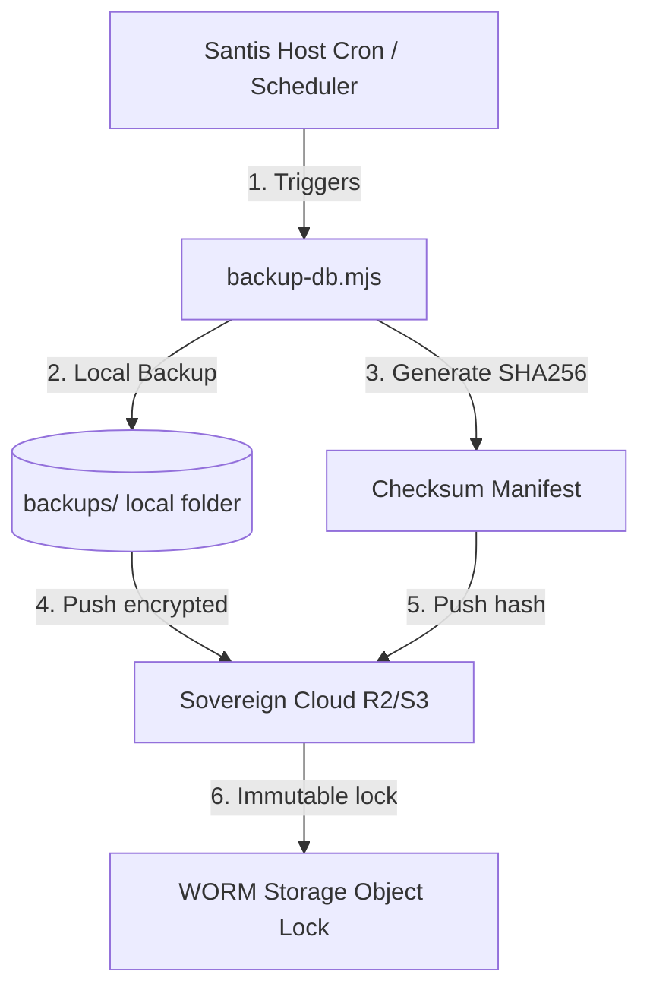

# 💾 Santis OS — Offsite Backup, Retention & Recovery Drill (TD-008.8)

This document establishes the enterprise-grade offsite backup synchronization framework, rotative retention policy, and structured disaster recovery drill procedure for Santis OS designed to align with high-durability object storage targets when R2/S3 Object Lock and lifecycle policies are enabled.

---

## 📊 1. RTO & RPO Metrics (Sovereign SLA)

To align with boarding protocols, we enforce strict bounds on data loss and restoration speeds:

| Metric | Target | Technical Mechanism |
| :--- | :--- | :--- |
| **RPO (Recovery Point Objective)** | **< 24 Hours** | Automated daily online backup captures at 03:00 UTC. |
| **RTO (Recovery Time Objective)** | **< 15 Minutes** | Zero-downtime termination, dynamic DB recreation, and plain SQL stream ingestion. |

---

## 🔒 2. Offsite Synchronization Architecture

All raw backup archives (`.sql.gz`) and checksum manifests (`.sql.gz.sha256`) reside strictly **local-only** inside the unprivileged host environment to prevent network-facing attack vectors.

For offsite synchronization, we utilize highly durable, encrypted Object Storage targets (AWS S3, Cloudflare R2, or Backblaze B2) using **S3 Object Locks & Versioning** to prevent ransomware tampering.

### Recommended Offsite Targets
1. **Cloudflare R2**: Zero egress fees, ideal for premium boutique SaaS operating at low latencies.
2. **AWS S3 Standard-IA (Infrequent Access)**: Standard durability, ideal for large enterprise workloads with rigid compliance targets.

### Offsite Sync Workflow


---

## ⏳ 3. Dual-Layer Retention Policy (GFS)

Santis OS enforces a Grandfather-Father-Son (GFS) rotation scheme across local and offsite vaults:

### 1. Local Tier (Fast Recovery)
- **Retention**: **7 Daily Backups**
- **Action**: Handled automatically in real-time by `backup-db.mjs`.

### 2. Offsite Tier (Deep Recovery)
- **Retention**: **30 Daily** + **12 Weekly** + **12 Monthly**
- **Action**: Managed via S3 Lifecycle Policies (Lifecycle Rules) on the bucket target:
  - Transition daily backups to Glacier Instant Retrieval after 30 days.
  - Expire all deep backups permanently after 365 days.

---

## 📝 4. Weekly Disaster Recovery Drill Runbook

To guarantee restoration capabilities, DevOps teams must execute a weekly dry-run drill on a staging/quarantine instance:

### Phase 1: Verification
1. Download the target backup `.sql.gz` and its corresponding `.sha256` manifest.
2. Run SHA256 verification to ensure no corruption has occurred:
   ```bash
   node scripts/active/restore-db.mjs backups/santis_backup_YYYYMMDD_HHMMSS.sql.gz
   ```
   *(Ensure SANTIS_RESTORE_CONFIRM is omitted first to test the safety guard blocking mechanism)*.

### Phase 2: Execution & Controlled Maintenance Drop
1. Set the safety authorization environment variable.
2. Execute the restore process into the staging container:
   ```bash
   SANTIS_RESTORE_CONFIRM=YES node scripts/active/restore-db.mjs backups/santis_backup_YYYYMMDD_HHMMSS.sql.gz
   ```
3. Verify that:
   - Client connections are terminated dynamically.
   - Database drop and recreation finishes without locking.
   - Verification query returns `1` (OK).

### Phase 3: Integrity Validation (Drill Sign-off)
1. Run target database schema query checks to verify the existence of all core tables (`core_state`, `tenant_config`, `billing_vault`).
2. Log recovery time and sign off the weekly manifest report.
